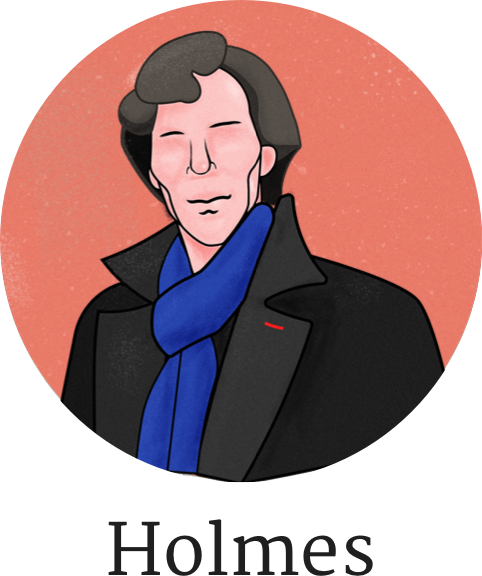

<br>

<p align="center">
  
</p>
<br>

<p align="center">
  
  
</p>

<br>

## Intro

- Koa2 with Mongo / Restful apis / Test
- Basic middleware: Error handler / Authorization
- Just write your controllors

<br>

## Usage

```bash
# download boilerplate and unzip it to your project name
wget -O Holmes.zip https://github.com/waynecz/Holmes/archive/master.zip && unzip Holmes.zip && mv Holmes-master {your project name}

# delete .zip file and entry your project
rm Holmes.zip && cd {your-project-name}

# create new one upon link your repo
git init && git remote add origin {your repo address}

# install dependices
yarn || npm i
```

1.  Replace things in [package.json](./package.json) with your own
2.  Start writting your server and:

    ```bash
    # develop
    npm run dev

    # run for production component
    npm run prod

    # test
    npm run test
    ```
